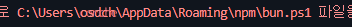

오늘도 즐겁게 코딩을 하던 중..
갑자기 문제가 발생했다!


~~이게 대체 무슨오류오류니...~~

찾아보니 두가지의 해결책이 나왔다!

## .ps1 파일 삭제

1. 오류내 파일 경로 확인
   발생한 오류를 잘 살펴보면..
   
   이런 식으로 오류가 발생한 파일의 경로를 확인 할 수 있다!

   <Aside>
      어떤 명령어를 통해 오류가 발생했냐에 따라서 경로가 바뀔
     수 있으나, 파일의 확장자는 모두 `.ps1` 로 끝나니 오류 경로 및 확장자를 잘 확인합니다.
   </Aside>

2. 파일 찾기
   경로를 확인 했으니 적혀있는 경로대로 들어가보면 문제의 파일 `npm.ps1` 을 발견할 수 있다!
   

3. 파일 삭제
   오류가 발생한 파일을 삭제해 주고 다시 명령어를 시도해보자!
   
   

## PowerShell 정책 변경

1. 현재 정책 확인
   PowerShell 창을 열고 아래 명령어를 입력한다.
   ```shell
   Get-ExecutionPolicy
   ```


위 사진처럼 Restricted 또는 AllSigned 라면 정책을 바꾸는 방법을 사용하자!

2. 정책 변경
   <Aside>반드시 PowerShell 을 관리자 권한으로 실행시켜야 합니다.</Aside>
   PowerShell 을 **관리자** 권한으로 열고 아래 명령어를 입력한다.

```shell
Set-ExecutionPolicy RemoteSigned -Scope CurrentUser
```


`실행 정책을 변경하시겠습니까?` 가 나오면 <kbd>Y</kbd>를 입력해서 실행 정책을 변경해주자!

3.  변경된 정책 확인
    다시한번 아래의 명령어를 입력해보면
    ```shell
    Get-ExecutionPolicy
    ```
        
    정책이 정상적으로 변경되었다면 RemoteSigned 가 나온다!

## 문제 해결 확인

오류 없이 작동하는지 확인해보자!

        

        오류없이 잘된다!!

        개인적으로는 권한을 변경하는것보다 파일을 삭제하는게 더 좋지 않을까 생각한다!
        ~~그리고 명령어 치는것보다 단순해서 좋다~~
