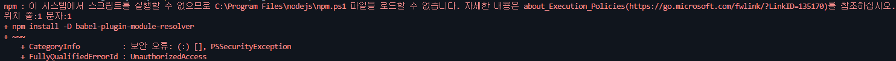
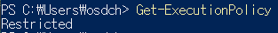
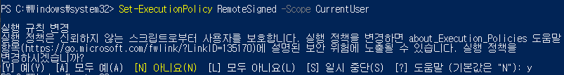
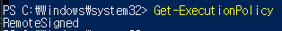
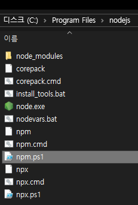
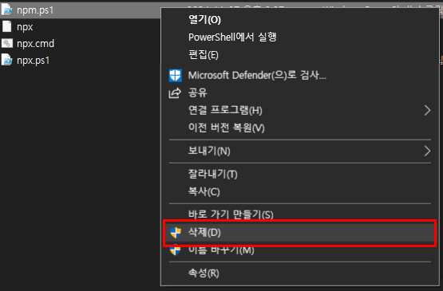
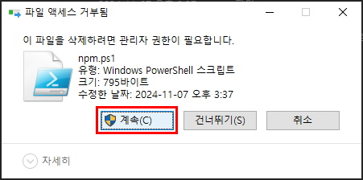
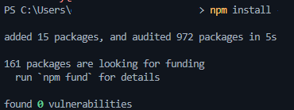

오늘도 즐겁게 코딩을 하던 중..

갑자기 오류가 발생했다!!!!!



`이 시스템에서 스크립트를 실행할 수 없으므로 c:\program files\nodejs\npm.ps1 파일을 로드할 수 없습니다. 자세한 내용은 about_execution_policies(https://go.microsoft.com/fwlink/?linkid=135170)를 참조하십시오.`

~~이게 대체 무슨오류오류니...~~

찾아보니 두가지의 해결책이 나왔다!

## PowerShell 정책 변경 (추천)

1. 현재 정책 확인

   PowerShell 창을 열고 아래 명령어를 입력한다.

   ```shell
   Get-ExecutionPolicy
   ```

   

   위 사진처럼 Restricted 또는 AllSigned 라면 정책을 바꾸는 방법을 사용하자!

2. 정책 변경

   <Aside>반드시 PowerShell 을 관리자 권한으로 실행시켜야 합니다.</Aside>
   PowerShell 을 **관리자** 권한으로 열고 아래 명령어를 입력한다.

   ```shell
   Set-ExecutionPolicy RemoteSigned -Scope CurrentUser
   ```

   
   `실행 정책을 변경하시겠습니까?` 가 나오면 <kbd>Y</kbd>를 입력해서 실행 정책을 변경해주자!

3. 변경된 정책 확인

   다시한번 아래의 명령어를 입력해보면

   ```shell
   Get-ExecutionPolicy
   ```



    정책이 정상적으로 변경되었다면 RemoteSigned 가 나온다!

## .ps1 파일 삭제

<Aside type='caution' title='파일 삭제보다 정책 변경을 권장합니다!'>
  파일 삭제의 경우 비슷한 오류가 추후에 또 발생할 수 있으니 정책을 변경 해주세요!!
</Aside>

1. 오류내 파일 경로 확인

   발생한 오류를 잘 살펴보면..

   

   이런 식으로 오류가 발생한 파일의 경로를 확인 할 수 있다!

   <Aside>
      어떤 명령어를 통해 오류가 발생했냐에 따라서 경로가 바뀔
     수 있으나, 파일의 확장자는 모두 `.ps1` 로 끝나니 오류 경로 및 확장자를 잘 확인합니다.
   </Aside>

2. 파일 찾기
   경로를 확인 했으니 적혀있는 경로대로 들어가보면 문제의 파일 `npm.ps1` 을 발견할 수 있다!

   

3. 파일 삭제
   오류가 발생한 파일을 삭제해 주고 다시 명령어를 시도해보자!

   

   

## 문제 해결 확인

오류 없이 작동하는지 확인해보자!



오류없이 잘된다!!

## 원인

원인은 PowerShell 의 보안 정책이었다.

PowerShell 의 기본 실행 정책(Restricted) 는 개별 명령 (`echo HelloWorld`) 는 허용하지만,

스크립트를 실행하려는 경우 허용하지 않고 아까와 같은 PSSecurityException 오류를 발생시키는 것이라고 한다.

사용자를 지키기 위한 정책이 오히려 사용자를 귀찮게 만드니 정책 같은거 만들땐 신경을 많이 써야 할 것 같다!
