<Aside>
  이 글은 Windows 에서 React Native Android 의 개발 환경을 설치하는 방법입니다. MacOS 또는 Linux
  등에서의 설치는 다른 글을 참조해 주세요!
</Aside>

> 왜 이 글을 쓰는가?

전에 설치하다가 몇몇 과정을 빼먹은 나머지 오류를 해결하는데에만 거진 하루를 다 써버려서.. ~~진짜 컴퓨터를 다 때려부시고 싶었~~ 
그래서 처음 RN을 접하는 분들은 제 뒤를 밟지 않길 바라며 적어봤습니다. 
최대한 자세히 기록했으니 앞으로 실수 할 일 없겠죠?

## Node.JS 설치

1. [nodejs 공식사이트](https://nodejs.org/ko)에서 LTS 버전을 다운 후 설치합니다.

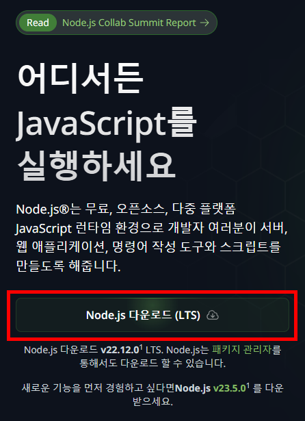

2. 설치 마법사에서 설정을 건드리지 않고 모두 "Next" 를 눌러 넘긴 후 "Install" 을 눌러 설치하면 됩니다.

3. 이후 터미널에 `node -v` 또는 `npm --version` 을 통해 설치한 버전이 나온다면 정상적으로 설치 되었습니다!

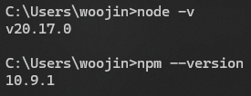

<Aside type='tip'>안된다면 터미널 또는 컴퓨터를 한번 껐다 켜주세요!</Aside>

## OpenJDK 설치

다양한 OpenJDK 가 있지만 이 글에서는 MicrosoftJDK 를 설치하겠습니다! (Corretto나 Zulu를 사용해도 되지만 OpenJDK가 설치되는 경로를 알고 있어야 합니다.)

1. [MicrosoftJDK 공식사이트](https://learn.microsoft.com/ko-kr/java/openjdk/download#openjdk-17)에서 17 버전을 다운 후 설치합니다.

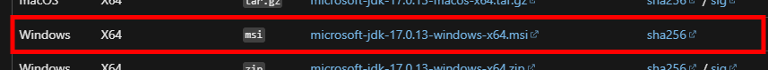

2. 마찬가지로 설치 마법사에서 설정을 건드리지 않고 모두 "Next" 를 눌러 넘긴 후 "Install" 을 눌러 설치합니다.

3. 이후 터미널에 `java -v` 를 통해 설치한 버전이 나온다면 정상적으로 설치 되었습니다!

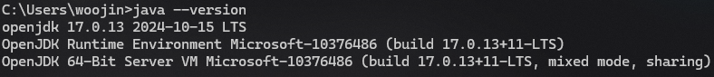

### 환경변수 설정

만일 아래처럼 찾을 수 없다고 나올 경우에는 번거롭지만 환경변수를 설정해 주어야 합니다.

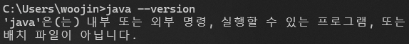

1. 윈도우 검색에서 "고급 시스템 설정" 을 검색해 "시스템 속성" 의 "고급" 탭 을 엽니다.
2. "환경 변수" 를 눌러 환경변수 편집 창을 엽니다.

   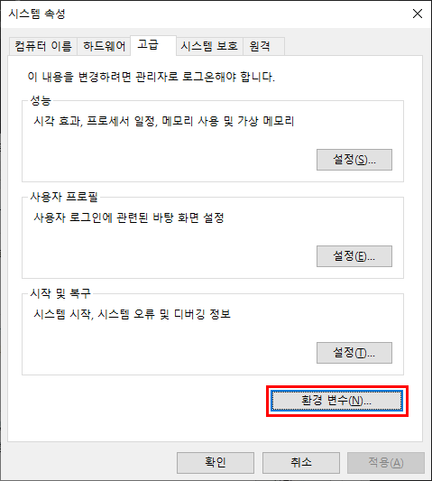

3. "시스템 변수" 에 "Path" 변수를 찾아 "편집" 버튼을 눌러줍니다.(또는 더블클릭)

   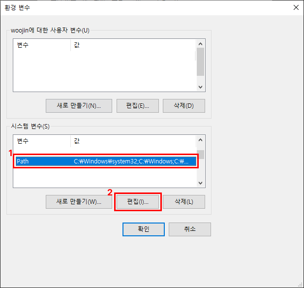

4. "새로 만들기" 를 누른 후

자신이 선택한 OpenJDK 의 bin 폴더 경로를 입력하고 <kbd>Enter</kbd>를 누른 뒤 "확인" 버튼을 눌러줍니다.

<Aside>
  저는 `C:\Program Files\Microsoft\jdk-17.0.13.11-hotspot\bin` 였으나, 다른 OpenJDK 를 설치한 경우
  파일 경로가 다를 수 있으니, 꼭 자신에게 맞는 bin 폴더 경로를 입력해 주세요.
</Aside>

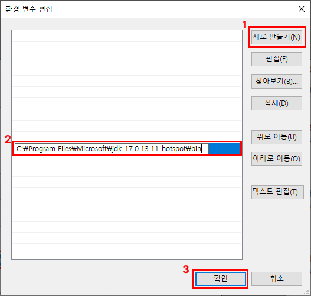

5. 이후 터미널에 `java -v` 를 통해 설치한 버전이 나온다면 정상적으로 설치 되었습니다!

   

   <Aside type='tip'>안된다면 터미널 또는 컴퓨터를 한번 껐다 켜주세요!</Aside>

## AndroidStudio 설치

1. [AndroidStudio 공식사이트](https://developer.android.com/studio?hl=ko) 에 들어가 좌측 중간쯤 부분에 있는 "Android 스튜디오 다운로드" 를 눌러줍니다.

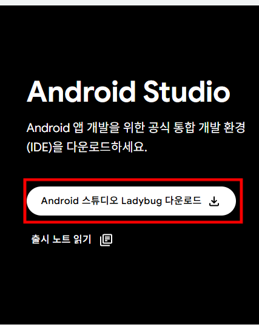

2. 이후 뜨는 약관 화면에서 맨 아래로 스크롤을 내려 약관에 동의하고 설치파일을 다운합니다.

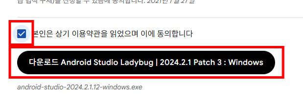

3. 마찬가지로 설치 마법사에서 설정을 건드리지 않고 모두 "Next" 를 눌러 넘긴 후 "Install" 을 눌러 설치합니다.

### Android Studio 초기설정

설치가 다 되었다면 Android Studio 를 실행해 줍니다.

최초로 Android Studio 를 실행하면 아래와 같은 화면이 뜹니다.

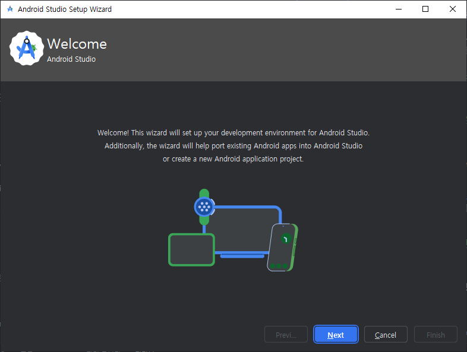

1. 우선 "Next" 를 누른 다음 "설치 타입 선택" 페이지에서 "Standard" 를 선택하고 "Next" 를 눌러줍니다.

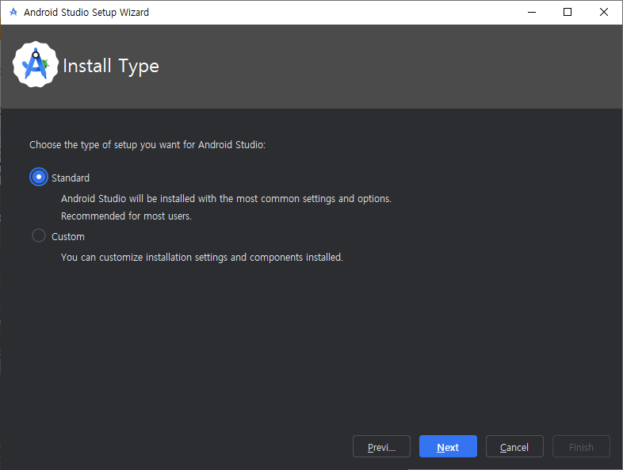

2. 그런 다음 "Next" 를 누르다 보면 아래와 같이 "라이선스 동의" 페이지가 뜨는데, 
   전부 동의해 주시면 됩니다.

3. 전부 다 동의를 하고 나면 "Finish" 버튼이 활성화 되는데, 누르면 기본 패키지가 설치됩니다.

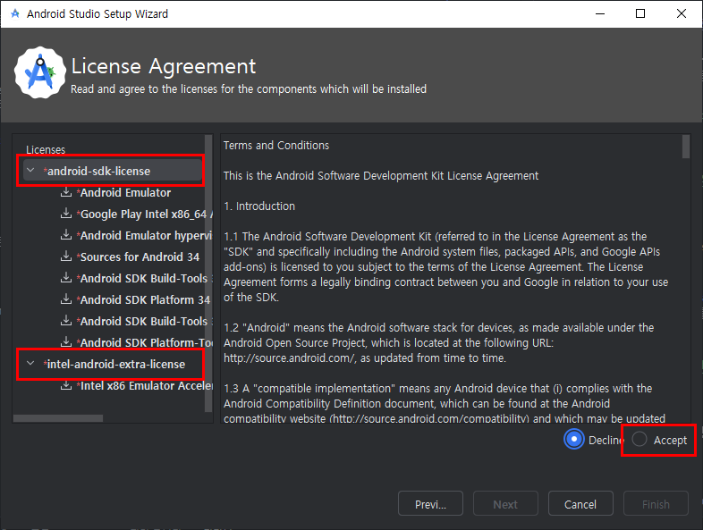

4. 설치 중간중간 뭔가 허용해달라는 창이 뜬다면 모두 "확인" 을 눌러주시면 됩니다.
5. 그렇게 설치가 완료되면 `successfully created` 가 뜨고 "Finish" 를 눌러 Android Studio 메인 화면을 띄워줍니다.

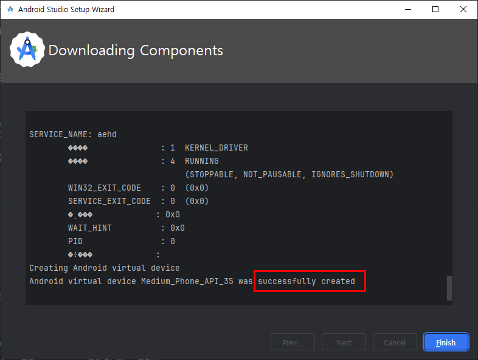

### SDK 설치

1. 안드로이드 스튜디오 메인 화면에서 화면 가운데에 있는 "More Actions" 를 누르고 "SDK Manager" 를 찾아 눌러줍니다.

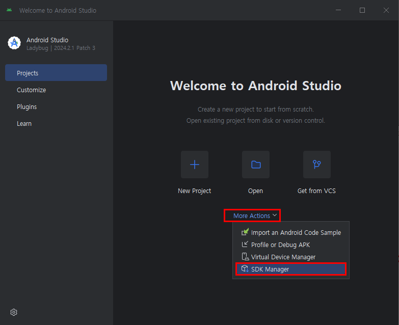

2. 그런 다음 새로 뜬 창 우측 아래 부분의 "Show Package Details" 버튼을 눌러줍니다.

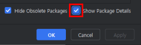

3. 그런 다음 "Android 15.0 ("Vanilla Cream")" 을 찾은 뒤 **좌측의 화살표**를 눌러 펼치면 여러 항목이 뜹니다. 
   여러 항목 중 "Android SDK Platform 35" 와 "Google Play Intel x86_64 Atom System Image" (또는 "Intel x86 Atom_64 System Image") 를 체크 모양으로 만들어 줍니다.(좌측의 - 모양을 누르면 됩니다.)

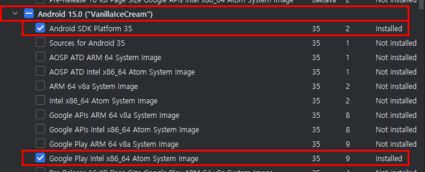

4. 그 다음 "SDK Tools" 탭을 눌러줍니다.

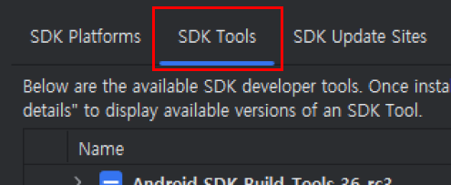

5. 그리고 여기서도 마찬가지로 우측 아래 부분의 "Show Package Details" 버튼을 눌러줍니다.

6. 이제 "Android Sdk Build-Tools 36-rc3" 을 찾아 **"35.0.0"** 을 체크해 줍니다.

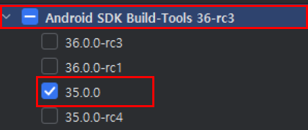

7. 마무리로 창 우측 하단의 "OK" 를 누르고 설치가 다 될때까지 잠시 기다린 다음 "Finish" 를 눌러줍니다.

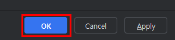

### 환경변수 설정

AndroidStudio도 마찬가지로 환경변수 설정이 필요합니다.
~~(이걸 몰랐던 과거의 나 반성하라)~~

1. 아까처럼 "시스템 속성" 의 "고급" 탭을 열고 "환경 변수" 를 눌러 편집 창을 엽니다.

2. "시스템 변수" 의 아래쪽에 "새로 만들기" 를 눌러줍니다.

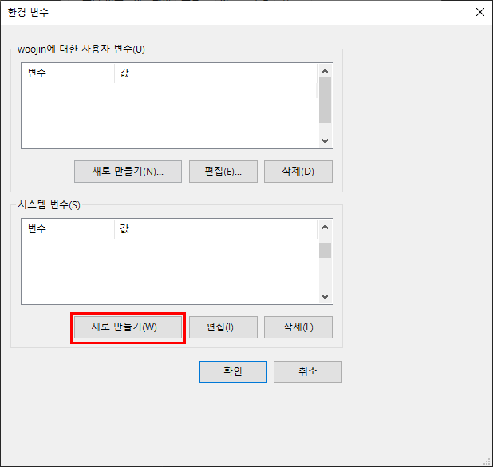

3. "변수 이름" 에는 `ANDROID_HOME` 을 "변수 값" 에는 `%LOCALAPPDATA%\Android\Sdk` 를 입력해 주고, 다 입력 했다면 "확인" 버튼을 눌러줍니다.

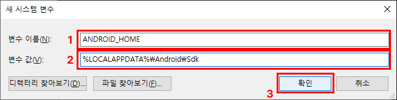

4. 다시 한번 "시스템 변수" 의 "Path" 변수를 찾아 "편집" 버튼을 눌러줍니다.

   

5. "새로 만들기" 를 누른 후 `%LOCALAPPDATA%\Android\Sdk\platform-tools` 를 입력하고 <kbd>Enter</kbd>를 누른 뒤 "확인" 버튼을 눌러줍니다.

   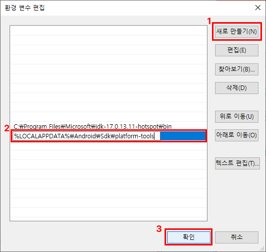

### 가상 디바이스 설정

앱 개발을 위해 안드로이드 기기를 직접 준비해서 사용해도 되지만, 안드로이드 기기가 없는 사람들은 가상 디바이스를 만들어 쓸 수 있습니다. 
핸드폰이 하나인 저로써는 가상 디바이스를 사용하는게 개발할 때 더 편했습니다.

1. 안드로이드 스튜디오 메인 화면에서 화면 가운데에 있는 "More Actions" 를 누르고 "Virtual Device Manager" 를 찾아 눌러줍니다.

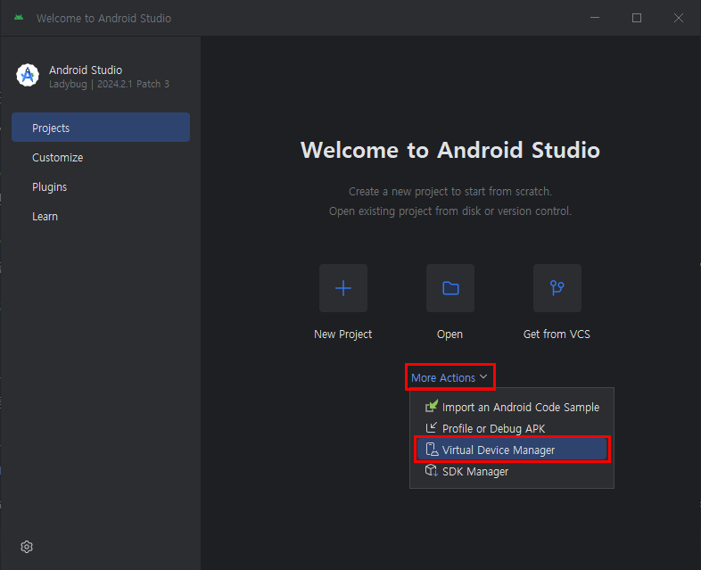

2. 가상 디바이스 관리 창의 좌측 상단에 있는 더하기 모양 버튼(Create Virtual Device) 를 눌러줍니다.

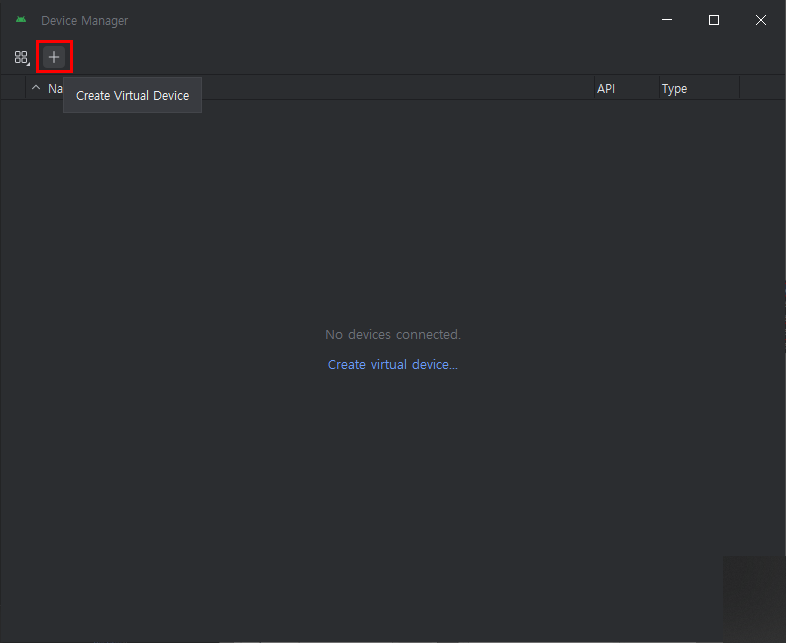

3. 생성하고싶은 디바이스 모델을 선택한 뒤 "Next"를 눌러줍니다. 
   <Aside>
     모델들은 모두 Google의 핸드폰인 Pixel 제품 밖에 없습니다. 그렇기에 창 우측의 모델 정보를 보며
     자신이 원하는 화면 크기를 찾으면 됩니다.
   </Aside>

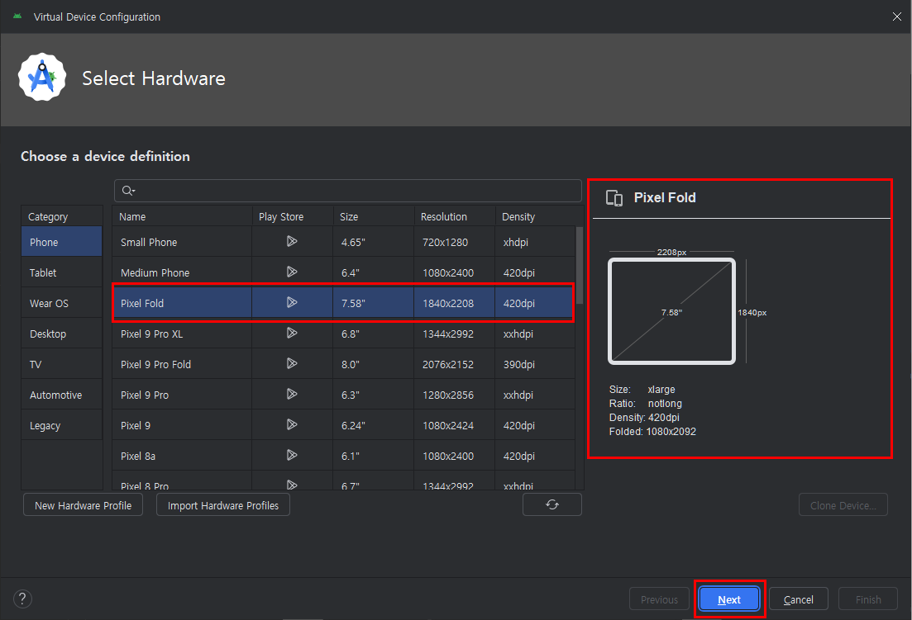

4. 선택한 모델에서 작동할 안드로이드 버전을 선택해 주는데, 이때 아까 설치한 "Vanilla Cream" 버전을 선택하면 됩니다.
   선택 한 뒤 "Next" 를 눌러줍니다.

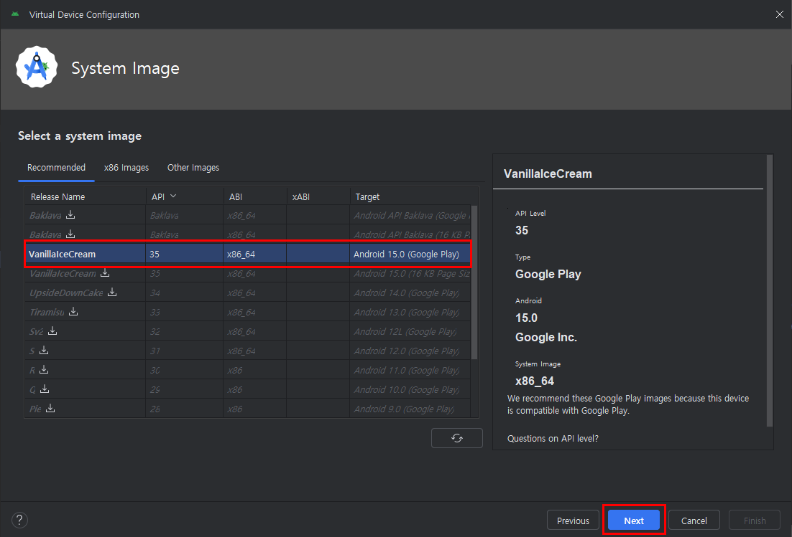

5. 이제 가상 기기의 이름을 정하고 저장 공간을 늘리고 싶다면(기본 Internal 2048 / SD 512)"Show Advanced Settings" 을 통해 원하는대로 설정을 맞추고 "Finish" 를 눌러 마무리 합니다.

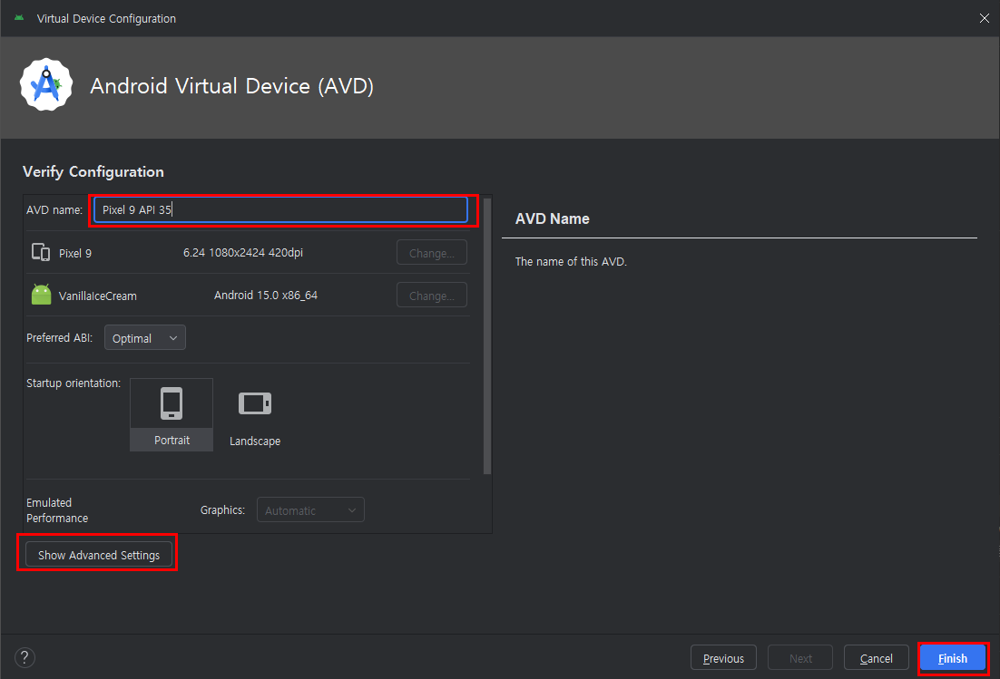

이제 필요할 때 오른쪽의 실행 버튼을 눌러 가상 디바이스를 시작할 수 있습니다!

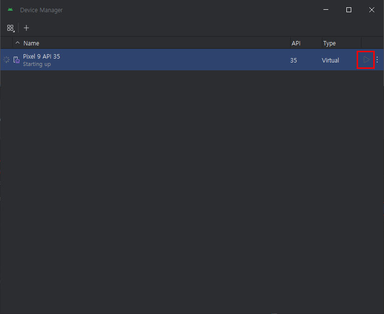

## React Native 프로젝트 만들기

모든 설정이 끝났다면 이제 리액트 네이티브 프로젝트를 생성해 보도록 합시다.

1. 터미널에 `npm i -g @react-native-community/cli` 를 입력합니다.

2. 터미널에 `npx @react-native-community/cli@latest init [원하는 프로젝트 이름]` 을 입력하고, 이후 y 를 한번 더 입력합니다.

3. 터미널에 `cd [원하는 프로젝트 이름]` 을 입력합니다.

4. 터미널에 `npm run android` 또는 `npm run` 을 통해 React Native 를 실행합니다!

이제 ReactNative 의 기초적인 실행환경이 구성되었습니다!

즐거운 개발생활 되시기 바랍니다!
